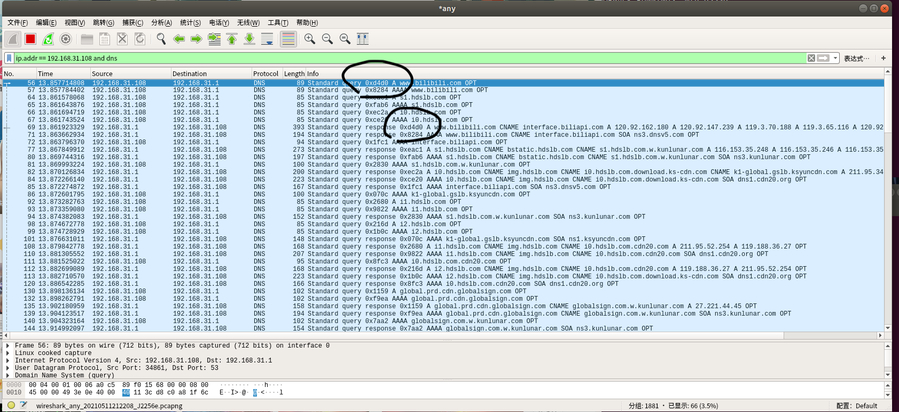

# *DNS Spoofing Attack (DNS Poison)* 相关实现

[Ref: SelinaDeepKaur](https://github.com/SelinaDeepKaur)/**[DNS-Injector-Detector](https://github.com/SelinaDeepKaur/DNS-Injector-Detector)**

-----


## 1 *DNS Spoofing Only*

### 1.1 运行方法

- 首先，攻击主机需要对 *Victim* 进行 ***ARP Spoofing***，从而插入到 *Victim* 到 *DNS server* 的路径中，以监听 *Victim* 的 *DNS* 请求包
    - 可以使用 *assignment 8* 中实现的 *bettercap* 进行实现
    - 也可直接开启攻击主机的热点，以供 *Victim* 连接

- 攻击主机运行 *Command:*  `sudo python3 DNS_Spoofing.py -i en0 -h hostnames udp`
    - `-i`：指定**攻击者实施攻击所监听的网络接口名称**
    - `-h`：指定写有待 *poison* 域名和 *IP* 的映射文件。文件内容如"www.sjtu.edu.cn 119.3.32.96"，用于表示仅针对哪些域名进行poison，注意后面的 *ip* 地址与域名并无对应关系。注意，后面的 *IP* 地址为想要重定向到的地址，在攻击时一般被设置为 *Victim host* 的 *IP* 地址。
    - `expression`：相当于是过滤器的选择，使用 `udp` 即可
- 在 *Victim* 上运行抓包工具 *Wireshark*，抓取攻击主机伪造的 *DNS* 响应包，以验证 *DNS Spoofing Attack* 的正确性。 

-------


### 1.2 实现流程及分析

- **攻击主机获得 *Victim* 的 *DNS* 请求包的方法：**
    
    - **简单的方法是攻击主机开热点，给 *Victim* 连接**，甚至可以直接将 *Victim* 的 *DNS server* 设置为攻击主机的 *IP* 地址
    - **更复杂的方法是使用 *ARP* 欺骗，将攻击主机作为路由插入到 *Victim* 和 *DNS* 服务器的路径中间**
    
- 在成功将攻击主机插入到 *Victim* 到 *DNS* 服务器的路径中之后，攻击主机即可通过监听**攻击主机自己的网络接口**，获得 *Victim* 发送给 *DNS server* 的 *DNS* 请求包。网络接口监听到的 *DNS* 请求包中，*IP src (192.168.31.229)* 应该为***Victim* 的 *IP* 地址**，*IP dst (192.168.31.1)* 应该为 ***Victim* 设置的 *DNS* 服务器的 *IP* 地址**。

- 攻击主机获得 *Victim* 发送给 *DNS server* 的 *DNS* 请求包，解析构造，获得 *IP dst*、*IP src*、*DNS ID*、*DNS rdata* 等信息，并伪造响应包进行 *send*，在被攻击主机 (*Victim*) 上进行抓包，证明 *Victim* 确实收到了伪造的 *DNS* 响应包，即**完成了 *DNS Spoofing* 的攻击流程**

- **伪造 *DNS* 请求包的内容：**
    -  *IP src*：*DNS server* 的 *IP* 地址  
    - *IP dst*：*Victim* 的 *IP* 地址
    - *UDP sport*、*UDP dport* 和 *DNS id* 不变
    - *DNS rdata*：*hostnames* 里面设置的 *redirect_dst*
    
- 具体流程：

    - *Step 1.* 在攻击主机上 (*Mac OS*) 上使用如下命令实施对 *Victim* (*Ubuntu*) 的 *ARP Spoofing Attack*

        - ```shell
            sudo bettercap
            net.recon on
            set arp.spoof.targets 
            arp.spoof on
            ```

        

        ​		在 *Victim host* 上通过 `arp -a` 指令查看 *DNS* 服务器的 *MAC* 地址，发现 *Victim* 看到的 *DNS server MAC* 从原来的 `9c:9d:7e:51:3f:2f` 变成了和攻击主机相同的 `f8:ff:c2:10:e4:bb`，*ARP Spoofing Attack* 成功。

        

        ​		此时，通过在攻击主机上运行 *Wireshark*，设置筛选条件为 `ip.addr==192.168.31.108 and dns` 来进行抓包，进而确定攻击主机可以监听到 *Victim* 发送的 *DNS pkt*。

        

        

    - *Step 2.* 在攻击主机上运行 `sudo python3 DNS_Spoofing.py -i en0 -h hostnames udp` 进入监听状态，当 *Victim* 访问位于 *hostnames* 名单上的域名 (*www.bilibili.com*) 时，攻击主机会获得监听信息，伪造一个 *DNS* 响应包，并 *send* 到局域网内。为了抓取该伪造的 *DNS* 响应包，我们在 *Victim* 上运行 *Wireshark* 进行抓包，并设置筛选条件为 `ip.addr==192.168.31.108 and dns` 来监听 *Victim* 的 *DNS* 包收发情况。

        注意，这里攻击主机会发送两条 *DNS id* 不同的响应包各两次，可能的原因是 *Victim* 和 *DNS server* 针对同一个 *DNS id* 会分别发送一条 *Query* 和 *Response*，均被攻击主机检测到，因此会发送两次。 之所以 *Victim* 上的 *Wireshark* 仅检测到一次 *Response*，推测的原因是 *Wireshark* 可能被设置为能够自动屏蔽 *DNS* 欺骗攻击。

        在 *Victim* 中打开的 *Wireshark* 中，观察到两条 *DNS Query* 的 *Transaction id* 分别为 `0xd4d0` 和 `0x8284`，相应的 *Response* 也是，这证明 *Victim* 正常并解析了攻击主机伪造的 *DNS* 响应包，*DNS Poison Attack (part 1)* 成功。 

        

    

    

    - *Step 3.* 在攻击主机上运行 `sudo python3 DNS_Spoofing.py -i en0 -h hostnames udp` 进入监听状态，并在 *Victim* 上运行 `sudo python DNS_Spoofing_detection.py -i wlp3s0` 进入 *DNS Poison* 的检测状态。当 *Victim* 访问位于 *hostnames* 名单上的域名 (*www.bilibili.com*) 时，攻击主机会获得监听信息，伪造一个 *DNS* 响应包，并 *send* 到局域网内。*Victim* 上的检测脚本则会比较收到的 *DNS id* 相同的响应包，并进行应答消息 *content* 的比较，若不同，则判定为一次 *DNS Poison Attack*，原因是攻击主机伪造的 *DNS* 响应包与真实 *DNS server* 返回的响应包在内容上仍有所差异，前者包含我们在 *hostnames* 中重定向的 *IP*，后者仍是相应域名所对应的正确 *IP*。

        

        

        可以看到，*Victim* 同攻击主机一样，也收到了两次相同的 *DNS Poison Attack* 记录，其 *DNS id* 与攻击主机中输出的伪造响应包的信息相同。收到两次原因是检测到攻击主机和 *DNS server* 返回的响应包时，都会分别触发一次记录。从两个包的不同对比可以看到，*Response packet 1* 包含了攻击主机重定向后的伪 *IP* 地址，*Response packet 2* 包含了 *DNS server* 返回的域名 (*www.bilibili.com*) 对应的真实 *IP*。*DNS Poison Attack (part 2)* 成功。 

    - 综上所述，本次 *DNS Poison Attack* 实验获得成功。

-------------

- ~~注意监听的网络接口**是攻击主机自己的网络接口**，从该接口获得含 *UDP* 报文的 *DNS* 请求包，解析构造，获得 *IP dst*、*IP src*、*DNS ID*、*DNS rdata* 等信息，并伪造响应包进行 *send*，在被攻击主机 (*Victim*) 上进行抓包，证明 *Victim* 确实收到了伪造的 *DNS* 响应包，即**完成了 *DNS Spoofing* 的攻击流程**~~
- ~~网络接口监听到的 *DNS* 请求包中，*IP src (192.168.31.229)* 应该为**攻击主机的 *IP* 地址**，*IP dst (192.168.31.1)* 应该为**攻击主机设置的 *DNS* 服务器的 *IP* 地址**。为了方便抓包，我们在伪造的 *DNS* 响应报文中设置 *IP dst* 为 *hostnames* 文件中定义的 *redirect_to* 地址，并将 *DNS* 请求包中的 *rdata* 也设置成 *redirect_to*。~~
- ~~在攻击主机上运行 `sudo python3 DNS_Spoofing.py -i en0 -h hostnames udp` 进入监听状态，当攻击主机的 `en0` (*wifi*) 网络接口访问在 *hostnames* 文件中指定的域名时，相应的 *DNS* 请求包会被捕捉到：~~


- ~~同时，在 *Victim* 主机上或攻击主机上使用 *Wireshark* 进行抓包，筛选条件为 `ip.addr==202.120.2.119`（这里为了便于抓包，我们选择将在伪造的 *DNS* 响应包中修改 *IP dst* 和 *DNS rdata*）。筛选结果如下：~~


- ~~为了验证抓包结果的正确性，我们首先观察包的 *Info* 字段：~~


​		~~可以看到，*Info* 提示该 *DNS* 报文属于响应包，且目的地 `www.bilibili.com` 的地址被成功篡改为 `202.120.2.119`，原因是我们设置了 *IP dst* 为该 *fake IP*~~

- ~~进一步通过 *DNS id* 的方式验证抓包结果的正确性，首先从攻击主机的输出信息中得知，该 *DNS* 的 *id* 为 *4139*。然后，在抓包工具 *Wireshark* 中查看该响应包的 *DNS id*：~~


​		~~为 `Transaction ID: 0x102b`，注意到为十六进制，因此使用进制转换器验证正确性：~~


- ~~注意到，伪造的 *IP dst* 还向攻击主机 (`192.168.31.229`) 发送了一条 *ICMP* 报文，告知该 *DNS* 请求包的 *dst* 无法到达，原因是攻击主机最远只能到达其本身设置的 *DNS* 服务器 (`192.168.31.1`)，不能跳出子网直接访问 `202.120.2.119`。这是因为我们直接使用攻击主机进行抓包，即**攻击主机和 *Victim*** 是同一台机器，下面将介绍在 *Victim host* 中进行抓包的结果。~~
- ~~在一台 *Win10* 主机中运行该 `DNS_Spoofing.py` 脚本，作为攻击主机，*MacOS* 运行 *Wireshark* 进行抓包。注意到，为了让伪造的 *DNS pkt* 能够到达 *Victim*，需要在 *Win10* 主机 (`192.168.31.251`) 中的 *hostnames* 内将 `www.bilibili.com` 的 *redirect_to* 配置为 *Victim* 的 *IP* 地址 (`192.168.31.229`)：~~


​		~~可以看到，攻击主机成功向 *Victim* 发送了两个伪造的 *DNS* 包。~~

- ~~在 *Victim* 中使用 *Wireshark* 嗅探到如下两个 *DNS* 响应包：~~


​		~~根据 *Info* 字段可以初步判定这两个 *DNS* 响应包 (*line 2, 3*) 就是在攻击主机中伪造并发送的 *DNS pkt*。再利用 *DNS id* 进一步判断：~~


​		~~可以看到 `0x28e6` 与攻击主机中打印的 *DNS id = 10470* 对应。~~

- ~~综上所述，本次 *DNS Poison Attack* 成功。~~


