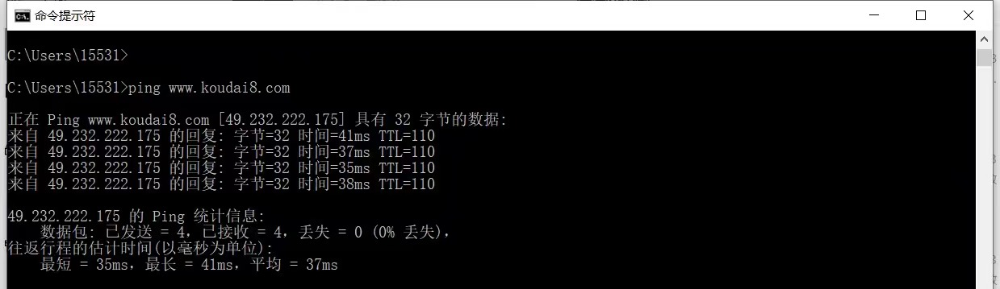
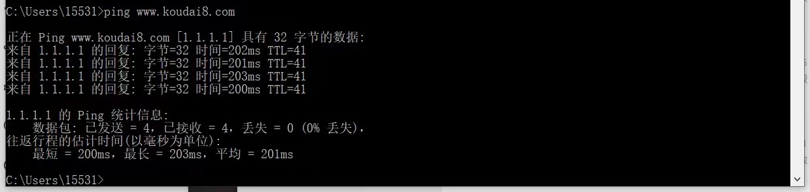
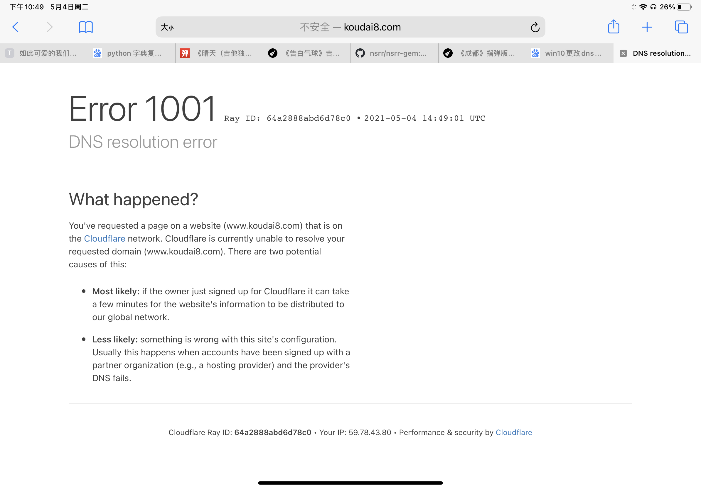
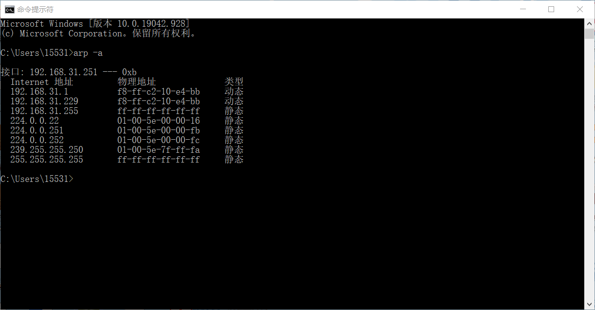

# *Wireshark* 流量分析及网络层攻击的实现

[Wireshark Document](https://www.wireshark.org/docs/wsug_html_chunked/ChCapInterfaceSection.html)

[Mac中wireshark如何抓取HTTPS流量](https://www.cnblogs.com/realjimmy/p/13418520.html)

-----

## 1 *Wireshark* 入门

- 当您**在不启动捕获或打开捕获文件的情况下打开Wireshark**时，它将显示“欢迎屏幕”，其中列出了**任何最近打开的捕获文件和可用的捕获接口**。每个接口的网络活动将显示在接口名称旁边的火花线中。**可以选择多个接口，同时从中捕获。**

​		注意：带有“齿轮”标识的接口允许或要求在捕获前配置，点击即可配置

​		Wireshark不仅限于网络接口——在大多数系统上，您还可以捕获USB、蓝牙和其他类型的数据包。

- 当您选择“捕获→选项...”（或使用主工具栏中的相应项）时，Wireshark会弹出“捕获选项”对话框。如果您不确定要在此对话框中选择哪些选项，那么在许多情况下，将默认设置保持原封状态应该可以很好地工作。

  

  - 输入Input：

    - 参数：
      - Interface：接口名称
      - Traffic：显示网络活动随时间推移的火花线
      - Link-layer Header：**此接口捕获的数据包类型**
      - Promiscuous：混杂模式
      - SnapLen (B)：快照长度，或**每个数据包捕获的字节数**
      - Buffer (MB)：保存捕获到的数据包的缓冲区大小，一般默认即可
      - Monitor Mode：让您捕获完整的原始 802.11 标头。支持取决于接口类型、硬件、驱动程序和操作系统。请注意，启用此功能可能会将您与无线网络断开连接。
      - Capture Filter：抓取过滤器，可双击进行编辑，可以被设置为多个
    - 将鼠标悬停在某个接口上或点击下拉可以显示与它关联的IPv4或IPv6地址

  - 输出Output：

    

  - 选项Option：

    

    - Display Options：
      - 实时更新数据包列表：在捕获期间实时更新数据包列表窗格。如果您不启用此功能，Wireshark在停止捕获之前不会显示任何数据包。当您检查此操作时，Wireshark会在一个单独的进程中捕获，并将捕获反馈到显示进程。
      - 实时抓拍时自动滚动：随着新数据包的出现，滚动数据包列表窗格，因此您总是查看最新的数据包。如果您没有指定此Wireshark，则将新数据包添加到数据包列表中，但不滚动数据包列表窗格。如果禁用“实时更新数据包列表”，此选项将显示灰色。
      - 在抓取过程中显示抓取信息
    - Name Resolution：
      - 解析Mac地址：将MAC地址转换为名称
      - 解析网络名称：将网络地址转化为名称
      - 解析运输名称：翻译运输名称（端口号）


-----


## 2 基于 *Wireshark* 的流量分析

- 仅对目标网站 *ping* 一次：

  ```shell
  ping -c 1 www.cs.sjtu.edu.cn
  ```

  - 此时利用 *Wireshark* 监控报文交换情况：
  
    
  
    ```
    10	8.084299	10.164.108.131	202.120.35.204	ICMP	98	Echo (ping) request  id=0x2a08, seq=0/0, ttl=64 (reply in 11)
    11	8.089303	202.120.35.204	10.164.108.131	ICMP	98	Echo (ping) reply    id=0x2a08, seq=0/0, ttl=251 (request in 10)
    ```
  
    - 上述数据单元分别表示：*frame number*、*time*、*source IP*、*destination IP*、*Protocol type*、*frame length*、*info*
    - 发现，本机 (`ip: 10.164.108.131`) 仅与目标网站 (`ip: 202.120.35.204`) 发生两次 `ICMP` 的报文交换。原因是 *ping* 指令是基于 *ICMP* 协议实现的。
    - `ICMP: Internet` 控制报文协议，它是 `TCP/IP` 协议族中的一个子协议，用于在 *IP* 主机，路由之间传递信息的协议。
    - `ping` 命令的机制就是回显请求和回显应答消息，具体是向网络上另一个主机上发送 `ICMP` 报文，如果指定的主机得到了这个报文，就将报文原封不动的发送回发送者。
    - [Ref:  基于ICMP协议的ping命令](https://blog.csdn.net/bian_cheng_ru_men/article/details/81476998)
  
- 直接采用浏览器访问目标网站：

  

  

  - 使用浏览器访问网站的过程：
    - 浏览器输入 [https://www.cs.sjtu.edu.cn](https://www.cs.sjtu.edu.cn) 之后，*DNS* 服务器进行域名解析，找到对应网站服务器的 *IP* 地址：*202.120.35.204*，并通过该 *IP* 找到客户端到服务器的路径。
    - 客户端 (*172.20.10.3*) 和服务器 (*202.120.35.204*) 建立 *TCP* 三次握手连接 ([Ref](https://www.cnblogs.com/kaleidoscope/p/9701117.html)) ：
      - 客户端主动打开，发送**连接请求报文段 (*No. 336*)**，将 *SYN* 标识为 *1*，*Sequence Number* 置为 *x* （*TCP* 规定 *SYN = 1* 不能携带数据，*x* 为随机产生的一个值），然后进入 *SYN_SEND* 状态
      - 服务器**收到 *SYN* 报文段并进行确认 (*No. 341*)**，将 *SYN* 标识位置置为 *1*，*ACK* 置为 *1*，*Sequence Number* 置为 *y*，*Acknowledgment Number* 置为 *x + 1*，然后进入 *SYN_RECV* 状态（半连接状态）
      - 客户端**再次进行确认 (*No. 342*)**，将 *ACK* 置为 *1*（此时不用 *SYN*），*Sequence Number* 置为 *x + 1*，*Acknowledgment Number* 置为 *y + 1* 并发向服务器，最后客户端与服务器都进入 *ESTABLISHED* 状态
    - 完成 *TCP* 连接的建立后，**客户端向服务器发送请求尝试报文 *Client Hello* (*No. 343*)**，**服务器回复客户端响应尝试报文 *Hello Retry Request* (*No. 346*)**
    - 完成请求和尝试报文的验证（即上述 *hello* 消息）后，**服务器向客户端发送 *Change Cipher Spec* 消息 (*No. 347*)**（[Ref](https://blog.csdn.net/weixin_43364172/article/details/83860247)，注意，当前状态为客户端和服务器先前已建立 *SSL Session*，否则将 *Change Cipher Spec* 消息放在 *SSL* 握手消息内）
    - 客户端首先返回给服务器一个 ***ACK* (*No. 348*)**，然后接着返回 ***Client Hello* 的 *Change Cipher Spec* 消息 (*No. 349*)**，表示 *Cipher Spec* 已修改完毕
    - 服务器首先返回给客户端一个 ***ACK* (*No. 351*)**，然后接着返回 *hello* 消息 ***Server Hello***，接着开始数据的正式传输
    - 观察到，服务器传输的报文中有很多被打上了 *TCP segment of a reaasembled PDU* 的标签，原因是 ([Ref](https://blog.csdn.net/thollych/article/details/103210932))：当我们基于TCP在传输消息时，对于上面的应用层如果出于某些原因（如超过MSS）TCP Segment不能一次包含全部的应用层PDU，而要把一个完整消息分成多个段，就会将除了最后一个分段（segment）的所有其他分段都打上“TCP segment of a reassembled PDU”。

  - 注意到，当同一个 *ip* 多次访问目标网站时，将并不会发生上述报文交换，猜测的原因是已将网站内容存储在本机的 *cache* 中

------


## 3 *DHCP* 欺骗攻击

[瑞士军刀 Bettercap2.4使用教程](https://blog.csdn.net/u012570105/article/details/80561778)

-  *nmap* 端口扫描工具的安装：[Ref](https://blog.csdn.net/weixin_28953819/article/details/113645153)

  ```shell
  brew install nmap
  ```

- 当前 *IP* 地址为 `192.168.31.229`，则扫描整个子网：

  ```shell
  sudo nmap -PS -O  192.168.31.1/24 -v
  ```

  `-PS`：nmap将通过发送单个SYN数据包来检查主机是否在线

  `-O`：指定检测远程主机的操作系统类型

  **作用是获得当前子网中可攻击的 *host***

----------------------------- 上述内容不包含在实验内容范围内 --------------------------

- *bettercap* 中间人攻击工具的安装：

  ```shell
  brew install bettercap
  ```

- 运行指令进入交互模式：

  ```
  sudo bettercap
  Password:
  bettercap v2.30.2 (built for darwin amd64 with go1.16.2) [type 'help' for a list of commands]
  
  10.166.0.0/16 > 10.166.185.228  »  
  ```
  
- 运行 `help` 指令查看帮助及模块运行情况：

  

- 将目标机器（即被攻击机器，处于同一网段下，且将 *DNS* 设置为攻击主机的 *ip* 地址）

  - *Win10* 设置 *DNS* 方法见：[Ref](https://jingyan.baidu.com/article/cdddd41cb5116a53cb00e106.html)

  - 利用 `ping` 指令查看当前 *Win10* 访问网站 `www.koudai8.com` 时访问的 *IP* 地址：

    

  - 发现相应的 *IP* 地址为 `49.232.222.175`

- 在攻击主机上运行 *DHCP* 欺骗功能：

  ```shell
  set dns.spoof.domains www.koudai8.com
  set dns.spoof.address 1.1.1.1
  dns.spoof on
  ```

- 再次运行 *Win10* 目标机器上的 `ping` 指令，观察到攻击主机上出现：

  ```
  192.168.31.0/24 > 192.168.31.229 >> [22:59:56] [sys.log] [inf] dns.spoof sending spoofed DNS reply for www.koudai8.com (->1.1.1.1) to 192.168.31.251 : 3c:95:09:df:34:89 (Liteon Technology Corporation) - LAPTOP-FI0PRTFC.local.
  ```

  

  *Win10* 目标机器上 `ping` 指令输出：

  

- 同样设置一个 *ipad* 作为测试载体，在 *Safari* 内访问 `www.koudai8.com`，发现报错 `Error 1001`：

  

- 据上述实验结果可知，*DHCP Spoofing* 攻击成功。


-------


## 4 *ARP* 欺骗攻击（*Mac* 地址欺骗攻击）

[中间人攻击之Bettercap工具使用](http://akevin.cn/index.php/archives/69/)

- 安装第 *3* 节中的方法安装好 *bettercap* 中间人攻击工具
- 首先打开 *bettercap* 的交互界面，并使用 *net.recon* 模块查看待攻击目标的 *ip* 地址
- 然后开启 *arp* 欺骗攻击：

```
sudo bettercap
net.recon on
set arp.spoof.targets 192.168.31.251
arp.spoof on
```

​		注意，若不指定攻击目标的 *ip*，则会向局域网内的所有 *host* 进行攻击

​		攻击主机的输出如下：


- 注意到，在开启 *ARP* 欺骗之前，选中的目标机器 (*Win10*) 查询到的局域网路由器 (*192.168.31.1*) 的 *MAC* 地址为 *9c-9d-7e-51-3f-2f*

  

- 开启 *ARP* 欺骗后，选择的目标机器查询到的局域网路由器的 *MAC* 地址为 *f8-ff-c2-10-e4-bb*，与攻击主机一致



- 据上述实验结果可知，*ARP Spoofing* 攻击 (*Mac Spoofing Attack*) 成功。

