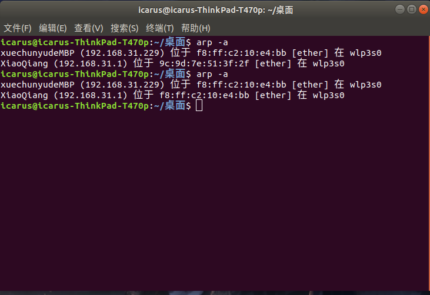
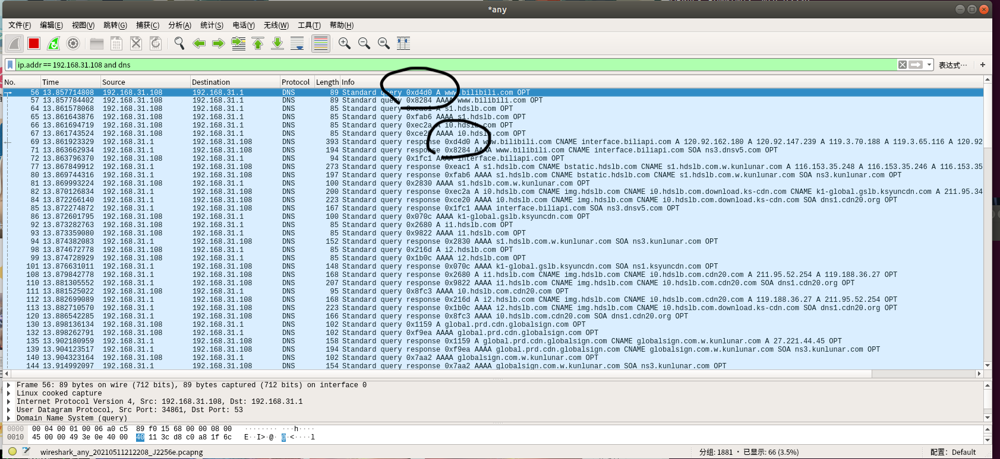

# *DNS Spoofing Attack (DNS Poison)* 相关实现

[Ref: SelinaDeepKaur](https://github.com/SelinaDeepKaur)/**[DNS-Injector-Detector](https://github.com/SelinaDeepKaur/DNS-Injector-Detector)**

-----


## 1 *DNS Spoofing Attack*

### 1.1 运行方法

- 首先，攻击主机需要对 *Victim* 进行 ***ARP Spoofing***，从而插入到 *Victim* 到 *DNS server* 的路径中，以监听 *Victim* 的 *DNS* 请求包
    - 可以使用 *assignment 8* 中实现的 *bettercap* 进行实现
    - 也可直接开启攻击主机的热点，以供 *Victim* 连接
- 攻击主机运行 *Command:*  `sudo python3 DNS_Spoofing.py -i en0 -h hostnames udp`
    - `-i`：指定**攻击者实施攻击所监听的网络接口名称**
    - `-h`：指定写有待 *poison* 域名和 *IP* 的映射文件。文件内容如"www.sjtu.edu.cn 119.3.32.96"，用于表示仅针对哪些域名进行poison，注意后面的 *ip* 地址与域名并无对应关系。注意，后面的 *IP* 地址为想要重定向到的地址。
    - `expression`：相当于是过滤器的选择，使用 `udp` 即可
- ***DNS Spoofing Only***：在 *Victim* 上运行抓包工具 *Wireshark*，抓取攻击主机伪造的 *DNS* 响应包，对比 *DNS id* 以验证 *DNS Spoofing Attack* 的正确性。 
- ***DNS Spoofing and Detection***：
    - 在 *Victim* 上运行脚本 *DNS_SPoofing_Detection.py*，嗅探并检测伪造的 *DNS* 响应包及相应真实的响应包。
    - *Command*：`sudo python DNS_Spoofing_detection.py -i wlp3s0 `

-------


### 1.2 实现流程及分析

- **攻击主机获得 *Victim* 的 *DNS* 请求包的方法：**
  
    - **简单的方法是攻击主机开热点，给 *Victim* 连接**，甚至可以直接将 *Victim* 的 *DNS server* 设置为攻击主机的 *IP* 地址
    - **更复杂的方法是使用 *ARP* 欺骗，将攻击主机作为路由插入到 *Victim* 和 *DNS* 服务器的路径中间**
    
- 在成功将攻击主机插入到 *Victim* 到 *DNS* 服务器的路径中之后，攻击主机即可通过监听**攻击主机自己的网络接口**，获得 *Victim* 发送给 *DNS server* 的 *DNS* 请求包。网络接口监听到的 *DNS* 请求包中，*IP src (192.168.31.229)* 应该为***Victim* 的 *IP* 地址**，*IP dst (192.168.31.1)* 应该为 ***Victim* 设置的 *DNS* 服务器的 *IP* 地址**。

- 攻击主机获得 *Victim* 发送给 *DNS server* 的 *DNS* 请求包，解析构造，获得 *IP dst*、*IP src*、*DNS ID*、*DNS rdata* 等信息，并伪造响应包进行 *send*，在被攻击主机 (*Victim*) 上进行抓包，证明 *Victim* 确实收到了伪造的 *DNS* 响应包，即**完成了 *DNS Spoofing* 的攻击流程**

- **伪造 *DNS* 请求包的内容：**
    -  *IP src*：*DNS server* 的 *IP* 地址  
    - *IP dst*：*Victim* 的 *IP* 地址
    - *UDP sport*、*UDP dport* 和 *DNS id* 不变
    - *DNS rdata*：*hostnames* 里面设置的 *redirect_dst*
    
- 具体流程：

    - *Step 1.* 在攻击主机上 (*Mac OS*) 上使用如下命令实施对 *Victim* (*Ubuntu*) 的 *ARP Spoofing Attack*

        - ```shell
            sudo bettercap
            net.recon on
            set arp.spoof.targets 192.168.31.108
            arp.spoof on
            ```

        

        ​		在 *Victim host* 上通过 `arp -a` 指令查看 *DNS* 服务器的 *MAC* 地址，发现 *Victim* 看到的 *DNS server MAC* 从原来的 `9c:9d:7e:51:3f:2f` 变成了和攻击主机相同的 `f8:ff:c2:10:e4:bb`，*ARP Spoofing Attack* 成功。

        

        ​		此时，通过在攻击主机上运行 *Wireshark*，设置筛选条件为 `ip.addr==192.168.31.108 and dns` 来进行抓包，进而确定攻击主机可以监听到 *Victim* 发送的 *DNS pkt*。

        

        

    - *Step 2.* 在攻击主机上运行 `sudo python3 DNS_Spoofing.py -i en0 -h hostnames udp` 进入监听状态，当 *Victim* 访问位于 *hostnames* 名单上的域名 (*www.bilibili.com*) 时，攻击主机会获得监听信息，伪造一个 *DNS* 响应包，并 *send* 到局域网内。为了抓取该伪造的 *DNS* 响应包，我们在 *Victim* 上运行 *Wireshark* 进行抓包，并设置筛选条件为 `ip.addr==192.168.31.108 and dns` 来监听 *Victim* 的 *DNS* 包收发情况。

        注意，这里攻击主机会发送两条 *DNS id* 不同的响应包各两次，原因是 *Victim* 针对同一个 *DNS id* 会分别发送一条指向 *IPv4* 和 *IPv6* 的 *Query*，分别对应 *A* 记录和 *AAAA* 记录 ，均被攻击主机检测到，因此会发送两次。 之所以 *Victim* 上的 *Wireshark* 仅检测到一次 *Response*，推测的原因是 *Wireshark* 可能被设置为能够自动屏蔽 *DNS* 欺骗攻击。

        在 *Victim* 中打开的 *Wireshark* 中，观察到两条 *DNS Query* 的 *Transaction id* 分别为 `0xd4d0` 和 `0x8284`，相应的 *Response* 也是，这证明 *Victim* 正常并解析了攻击主机伪造的 *DNS* 响应包，*DNS Poison Attack (part 1)* 成功。 

        

    

    

    - *Step 3.* 在攻击主机上运行 `sudo python3 DNS_Spoofing.py -i en0 -h hostnames udp` 进入监听状态，并在 *Victim* 上运行 `sudo python DNS_Spoofing_detection.py -i wlp3s0` 进入 *DNS Poison* 的检测状态。当 *Victim* 访问位于 *hostnames* 名单上的域名 (*www.bilibili.com*) 时，攻击主机会获得监听信息，伪造一个 *DNS* 响应包，并 *send* 到局域网内。*Victim* 上的检测脚本则会比较收到的 *DNS id* 相同的响应包，并进行应答消息 *content* 的比较，若不同，则判定为一次 *DNS Poison Attack*，原因是攻击主机伪造的 *DNS* 响应包与真实 *DNS server* 返回的响应包在内容上仍有所差异，前者包含我们在 *hostnames* 中重定向的 *IP*，后者仍是相应域名所对应的正确 *IP*。

        

        

        可以看到，*Victim* 同攻击主机一样，也收到了两次相同的 *DNS Poison Attack* 记录，其 *DNS id* 与攻击主机中输出的伪造响应包的信息相同。收到两次原因是检测到攻击主机和 *DNS server* 返回的响应包时，都会分别触发一次记录。从两个包的不同对比可以看到，*Response packet 1* 包含了攻击主机重定向后的伪 *IP* 地址，*Response packet 2* 包含了 *DNS server* 返回的域名 (*www.bilibili.com*) 对应的真实 *IP*。*DNS Poison Attack (part 2)* 成功。 

    - 综上所述，本次 *DNS Poison Attack* 实验获得成功。


