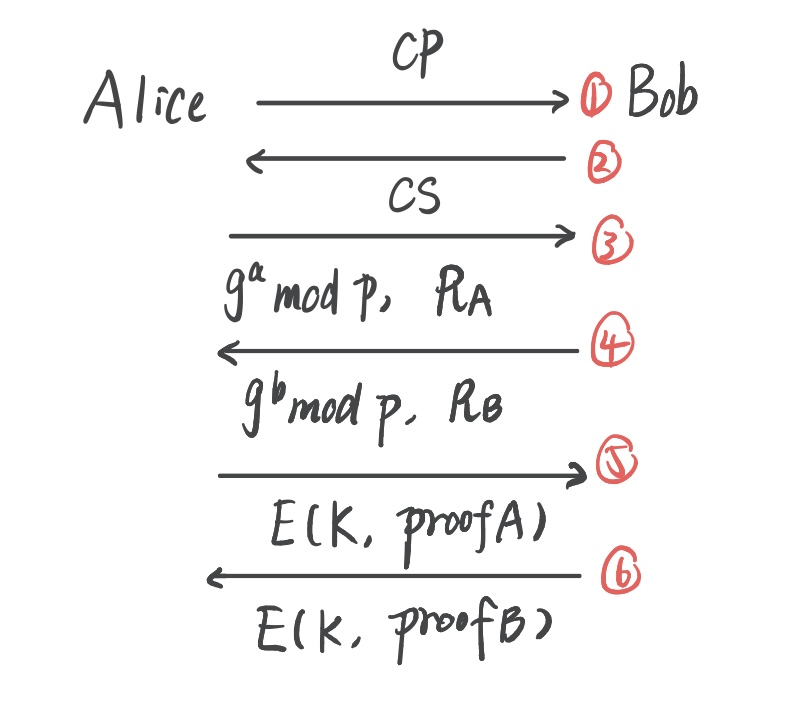
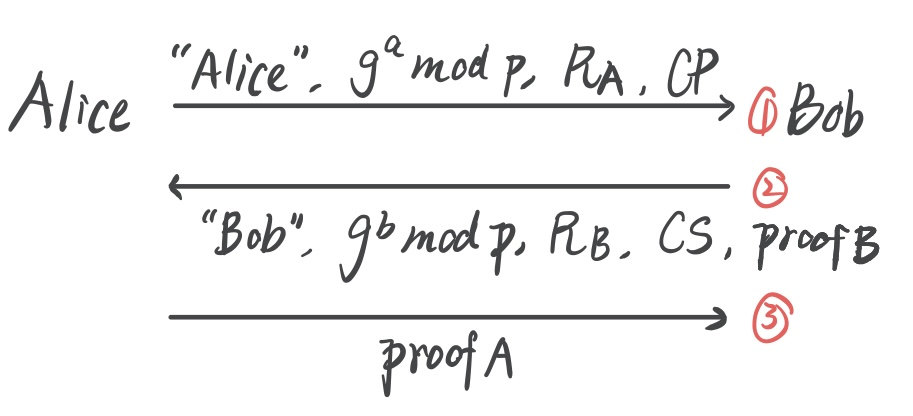

# 网络安全技术 Lecture 8 SSL和IPSec

--------

## 1 安全套接字协议 *SSL, Secure Socket Layer*

### 1.1 *Basic Idea*

- **套接字层 *Socket Layer*** 位于应用层和传输层之间，*SSL* 一般位于 *HTTP* 和 *TCP* 之间
- 什么是 *SSL*？
  - *SSL* 是用于 *Internet* 上大多数安全通讯的协议

-----

### 1.2 简单的类 *SSL* 协议 *Simple SSL-like Protocol*

- *Case 1*：**单向认证**（仅 *Alice* 认证了 *Bob*，*Bob* 不关心对方是谁，即**我们平常访问 *HTTPS* 网站的过程**）

  

  - 流程：
    - *Alice* 告诉 *Bob* ：我想和你安全地通信
    - *Bob* 回复 *Alice*：好呀，这是我的数字证书
    - *Alice* 回复 *Bob*：不行，你还得再用你的私钥把用你的公钥加密的密钥 $K_{AB}$ 解出来
    - *Bob* 回复 *Alice*：好的，这是用我解出来的会话密钥 $K_{AB}$ 加密过后的 *HTTP*，请查收
    - *Alice* 回复 *Bob*：好的，看来你就是 *Bob*！可以开始安全通信了～
  - *Alice* 知道她在和 *Bob* 通信吗？
    - 知道。因为 ***Bob* 的数字证书 $Cert_{B}$** 再加上 ***Bob* 使用私钥解开 $\{K_{AB}\}_{Bob}$** 能够让 *Alice* 确保是在和 *Bob* 通话
      - **只使用 *Bob* 的数字证书不行**，原因是**攻击者也可能持有 *Bob* 的证书**
      - 只使用 *Alice* 发给 *Bob* 验证的 $\{K_{AB}\}_{Bob}$？
        - 不行，**因为需要从 *Bob* 的数字证书里获得 *Bob* 的公钥**
  - 达成了数据机密性 *Confidentiality*？已达成
  - 达成了前向安全？没有

- *Case 2*：**单向认证**（仅 *Alice* 认证了 *Bob*，*Bob* 不关心对方是谁）

  

  - *S* 是由 *Alice* 随机挑选得到的
  
  - **会话密钥的计算：** $K = h(S, \ R_A, \ R_B)$
  
  - *msgs = all previous messages*
  
  - 流程：
    - *Alice* 发给 *Bob* 一个自己随机生成的报文 $R_A$
    - *Bob* 一看有人想和他安全通信，于是回复对方自己的数字证书，以及自己随机生成的报文 $R_B$
    - *Alice* 回复 *Bob*：不行，我先随机选一个报文 *S*，你还得再用你的私钥把用你的公钥加密的 *S* 解出来，再**用 *S*、$R_A$ 和 $R_B$ 一起算出会话密钥 *K*，**再**用算出来的 *K* 解出我用 *K* 对称加密的 $E(K, h(msgs  \ || \ K))$**，**并把 $h(msgs  \ || \ K)$ 还给我**
    - *Bob* 回复 *Alice*：给你
    - *Alice* 回复 *Bob*：好的，看来你就是 *Bob*！可以开始安全通信了～
    
  - 问题：如果将 $E(K, \ h(msgs || K))$ 替换成 $h(msgs || K)$，该协议是否仍然是安全的？
    - 协议还将安全。原因是只有 *B* 可以对 $\{S\}_B$ 进行解码，并生成正确的 $h(msgs || K)$，因此 *Alice* 仍能够对 *Bob* 进行认证
    
  - 问题：那么，为什么要在该步骤中添加对称加密步骤 *E* 呢？
    - 在步骤 *3* 中发送的 $E(K，h(msgs \ || \ K))$ 可以使**拒绝服务攻击 (*DoS, Denial-of-Service*)** 更加困难。 如果删除该加密步骤，攻击者只需**在步骤 *3* 中向 *Bob* 发送一个随机数，然后放弃该连接，迫使 *Bob* 保持打开状态直到超时，这会浪费 *Bob* 一侧的资源**。 如果攻击者从不同来源重复多次，直至达到限制，*Bob* 将停止接受新的连接，*DoS* 攻击成功。
      
      如果设置了加密 $E(K，h(msgs \ || \ K))$，则攻击者必须发起**重播攻击**，这使其变得更难，因为他必须先窃听合法连接。原因是当设置了加密 $E(K，h(msgs \ || \ K))$ 时，攻击者伪造的随机数很大概率将不会导致 *Bob* 保持打开状态。
    
  - 问题：如果直接将 $E(K，h(msgs \ || \ K))$ 删去，该协议是否还是安全的？
    - 协议还将安全。原因只有 *B* 可以对 $\{S\}_B$ 进行解码，但会对 *DoS* 攻击更加脆弱。
    
  - 达成了数据机密性 *Confidentiality*？已达成
  
  - 达成了前向安全？没有

-----

### 1.3 *SSL* 会话 vs *SSL* 连接

- *SSL* 被设计在 *HTTP 1.0* 中使用，*HTTP 1.0* 通常会打开多个同时（并行）的连接
- *SSL* 会话的建立花费很大，原因是一些公钥操作
- ***SSL* 对于在一个已有会话上建立新的连接有一个非常高效的协议**
  - 如果 *Alice* 和 *Bob* 之间的会话存在，那么他们之间就共享一个对称的会话密钥 *K*，能够快速建立连接

------

### 1.4 *SSL* 连接

- **假设 *SSL* 会话已经存在**，所以 ***S* 对于 *Alice* 和 *Bob* 都是已知的**，因此不需要之前的公钥操作！（$\{S\}_{Bob}$）
  - 也不需要对 *Bob* 的数字证书进行认证，以获取 *Bob* 的公钥（对 $h(msgs  \ || \ K)$ 的加密也不再需要）
  - 由于攻击者不知道 *S*，因此就算截取到了 $h(msgs  \ || \ K)$ 和 $R_A$，$R_B$，也无法恢复出该轮连接的会话密钥 $K$
  - 这里 $h(msgs  \ || \ K)$ 的作用更像一个 *ACK*

-----

## 2 IPSec

### 2.1 *Basic Idea*

- *IPSec* 位于网络层，对应用程序来说是透明的
- *IPSec* 中，需要讨论两个部分：
  - **互联网密钥交换 *IKE, Internet Key Exchange***：建立一个会话密钥
  - **封装安全负载/身份验证标头 *ESP/AH, Encapsulating Security Payload/Authentication Header***：安全信道如何工作
- 我们目前只讨论了如何建立一个会话密钥，还没有讨论安全信道是如何工作的

-----

### 2.2 互联网密钥交换 *IKE, Internet Key Exchange*

- *IKE* 有**两个阶段**：

  - 阶段一：**主会话密钥设置 *Master Session Key Setup***
    - **与 *SSL* 会话比较**
  - 阶段二：***ESP* 和/或 *AH* 密钥设置**
    -  **与 *SSL* 连接比较**，并不涉及

- ***IKE* 阶段一**：

  - 对于下述三种方案，都有两种不同的模式选择：

    - **主模式 *Main Mode***：

        - 速度较慢，需要交互 *6* 个信息（来回 *6* 次）

        - 更严谨安全的协商，对 *ID* 信息进行了加密，针对对端身份进行保护

        - 确定预共享密钥的方式：只能基于 *IP* 地址来确定

            
    
    - **进攻模式 *Aggressive Mode***：
    
        - 速度较快，需要交互 *3* 个信息（来回 *3* 次）
        - 受交换次数的限制，没有对对端身份进行保护（公钥加密的进攻模式除外
        - 确定预共享密钥的方式：基于 *ID* 信息（主机名、*IP* 地址）来确定
    
        
    
        

  |          | 基于公钥加密                                                 | 基于数字签名                                                 | 基于对称加密                                                 |
  | -------- | ------------------------------------------------------------ | ------------------------------------------------------------ | ------------------------------------------------------------ |
  | 主模式   | 对3、4中的 $R_A$、$R_B$ 进行公钥加密，附上对自己名字的公钥加密 | 对5、6中的 $proof_A$、$proof_B$ 进行私钥签名，并在会话密钥加密时先 $||$ 自己的名字再加密 | 在生成会话密钥 $K$ 的最后加上对称密钥 $K_{AB}$，并在5、6会话密钥加密时先 $||$ 自己的名字再加密 |
  | 进攻模式 | 在1、2中分别对 ""*Alice*"/"*Bob*" 和 $R_A$/$R_B$ 进行公钥加密 | 对3、2中的 $proof_A$、$proof_B$ 进行私钥签名                 | 在生成会话密钥 $K$ 的最后加上对称密钥 $K_{AB}$               |

  

  - 因此阶段一有 *6* 个类别

  - 根据 *IKE* 的指定：**主模式必须被实现**，**进攻模式应该被实现**（如果不实现，应该感到 *guilty*）

  - 三种方案：

    - **基于公钥加密 *Public Key Encryption Based***

      - 主模式：

        

        - $K = h(g^{ab} \bmod p, \ R_A, \ R_B)$
        - $SKEYID = h(R_A, \ R_B, \ g^{ab} \bmod p)$
        - $proof_A = h(SKEYID, \ g^a \ \bmod p, \ g^b \bmod p, \ CP, \ "Alice")$
        - $proof_B = h(SKEYID, \ g^a \ \bmod p, \ g^b \bmod p, \ CS, \ "Bob")$
      
    - 进攻模式：
    
      
    
      - $K, \ proof_A, \ proof_B$ 和主模式中的计算相同
      - 只不过**身份和主模式一样被保护了**（唯一）
      - 那么，为什么还需要主模式？
        - 假设攻击者生成了：
          - 指数 *a* 和 *b* 
          - 随机数 $R_A$ 和 $R_B$
        - **攻击者可以计算“合法”的密钥和 *proofs*：**
          - $g^{ab} \bmod p$、*K*、*SKEYID*、$proof_A$、$proof_B$
        - 也适用于主模式
        - 则攻击者可以创造看似是在 *Alice* 和 *Bob* 之间的交换，任何人看起来都合法（包括 *Alice* 和 *Bob*）！
          - 此时，假设攻击者扮演 *Alice*，则只需要将生成的 $R_A$ 和 *Alice* 的 *ID* 使用 *Bob* 的公钥进行加密即可，不需要知道 *Alice* 的私钥！
    
      - **合理的否认 *Plausible Deniability***
        - 在该 *IPSec* 模式下，是一个特征
          - *Alice* 和 *Bob* 可以否认任何一个通话的发生
        - 在一些情况下，确实会成为安全漏洞
          - 如果 *Alice* 从 *Bob* 那里买了东西，她可以之后否认（除非签了名）
    
    - **基于数字签名 *Signature Based***
    
      - 主模式：
    
        
    
        - *CP*：提议的加密，*CS*：选择的加密
        - $K = h(g^{ab} \bmod p, \ R_A, \ R_B)$
        - $SKEYID = h(R_A, \ R_B, \ g^{ab} \bmod p)$
        - $proof_A = [h(SKEYID, \ g^a \ \bmod p, \ g^b \bmod p, \ CP, \ "Alice")]_{Alice}$
        - $proof_B = [h(SKEYID, \ g^a \ \bmod p, \ g^b \bmod p, \ CS, \ "Bob")]_{Bob}$
    
      - 进攻模式：
    
        
    
        - 和主模式的不同：**不会尝试去保护身份**，**无法协商 *g* 和 *p***（原因是g、p和CP、CS同时传输）
    
    - **基于对称密钥 *Symmetric Key Based***
    
      - 主模式： 
    
        
    
        - **$K_{AB}$ 是先前就共享的对称密钥**
        - $K = h(g^{ab} \bmod p, \ R_A, \ R_B, \ K_{AB})$
        - $SKEYID = h(K, \ g^{ab} \bmod p)$
        - $proof_A = h(SKEYID, \ g^a \ \bmod p, \ g^b \bmod p, \ CP, \ "Alice")$
        - $proof_B = h(SKEYID, \ g^a \ \bmod p, \ g^b \bmod p, \ CS, \ "Bob")$
        - 注意：**没有再使用私钥进行签名**！原因是**对称密钥的存在**
        - 问题：*Alice* 将 *ID* 发送    $\leftarrow$    *Alice* 的 *ID* 用 *K* 加密    $\leftarrow$     为了找到 *K* *Bob* 必须知道 $K_{AB}$    $\leftarrow$    为了找到 $K_{AB}$ *Bob* 必须知道他正在和 *Alice* 通信
          - *Alice* 的 *ID* 必须是 *IP* 地址（**这不是悖论吗**？必须知道Alice的ID才能确定K，但必须确定K才能获取Alice的ID）**通过收到消息的 *IP* 地址，在本地找对应的对称密钥**
    
      - 进攻模式：与基于数字签名的进攻模式相同，没有该主模式的问题

  - 问题：在 *IKE* 阶段*1* 基于数字签名的主模式中，$ proof_A $ 和 $ proof_B $ 分别由 *Alice* 和 *Bob* 签名。 但是，在基于 *IKE* 阶段 *1* 的基于公钥加密的主模式下，$ proof_A $ 和 $ proof_B $ 既未签名也未加密，说明为什么他们仍然可以安全地执行身份验证？

    - 原因是，在基于公钥加密的主模式中，我们对 $R_A$ 和 $R_B$ 分别使用 *Bob* 和 *Alice* 的公钥进行了加密，只有使用对应的私钥才能解出 $R_A$ 和 $R_B$，因此攻击者无法得知。而要想生成 *proof*，就必须要知道 *SKEYID*，进而必须要知道 $R_A$ 和 $R_B$，因此该协议是安全的。 

